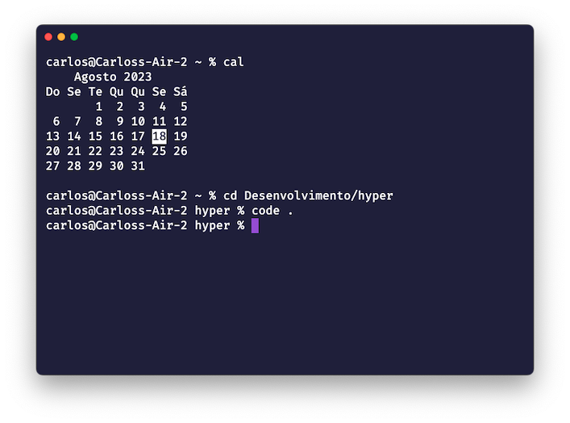

## Hyper Settings

[Hyper](https://hyper.is/) is an Electron-based terminal built on HTML/CSS/JS



this github contains my own Hyper settings

To use this settings, replace the .hype.js in home directory:

- **MacOS**: Command (⌘) + Shift + .

## Other settings

**VSCode Theme:**

- [Shades of Purple](https://marketplace.visualstudio.com/items?itemName=ahmadawais.shades-of-purple)

**Font:**

- [FiraCode](https://marketplace.visualstudio.com/items?itemName=SeyyedKhandon.firacode)

If you're using Fedora Linux, install the FiraCode font by running the following command:

```shell
sudo dnf install fira-code-fonts
```
